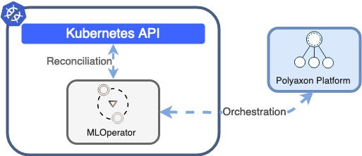

# Machine Learning Operator & Controller for Kubernetes

## Introduction

Kubernetes offers the facility of extending it's API through the concept of 'Operators' ([Introducing Operators: Putting Operational Knowledge into Software](https://coreos.com/blog/introducing-operators.html)). This repository contains the resources and code to deploy an Polyaxon native CRDs using a native Operator for Kubernetes.

This project is a Kubernetes controller that manages and watches Customer Resource Definitions (CRDs) that define primitives to handle, operate and reconcile operations like: builds, jobs, experiments, distributed training, notebooks, tensorboards, kubeflow integrations, ...

## Kubeflow operators

This Operator extends natively [Kubeflow-Operators](https://github.com/polyaxon/training-operator) (TFJob/PytorchJob/MXNet/XGBoost/MPI).
